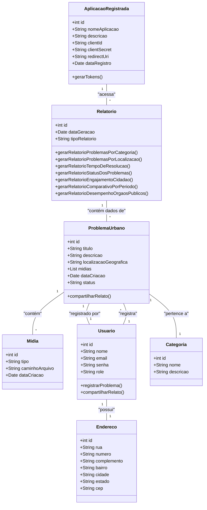

```mermaid
classDiagram
    class ProblemaUrbano {
        +int id
        +String titulo
        +String descricao
        +String localizacaoGeografica
        +List<Midia> midias
        +Date dataCriacao
        +String status
        +compartilharRelato()
    }

    class Midia {
        +int id
        +String tipo
        +String caminhoArquivo
        +Date dataCriacao
    }

    class Relatorio {
        +int id
        +Date dataGeracao
        +String tipoRelatorio
        +gerarRelatorioProblemasPorCategoria()
        +gerarRelatorioProblemasPorLocalizacao()
        +gerarRelatorioTempoDeResolucao()
        +gerarRelatorioStatusDosProblemas()
        +gerarRelatorioEngajamentoCidadao()
        +gerarRelatorioComparativoPorPeriodo()
        +gerarRelatorioDesempenhoOrgaosPublicos()
    }

    class Usuario {
        +int id
        +String nome
        +String email
        +String senha
        +String role
        +registrarProblema()
        +compartilharRelato()
    }

    class Endereco {
        +int id
        +String rua
        +String numero
        +String complemento
        +String bairro
        +String cidade
        +String estado
        +String cep
    }

    class Categoria {
        +int id
        +String nome
        +String descricao
    }

    class AplicacaoRegistrada {
        +int id
        +String nomeAplicacao
        +String descricao
        +String clientId
        +String clientSecret
        +String redirectUri
        +Date dataRegistro
        +gerarTokens()
    }

    ProblemaUrbano "1" -- "*" Midia : "contém"
    ProblemaUrbano "1" -- "1" Usuario : "registrado por"
    ProblemaUrbano "1" -- "1" Categoria : "pertence a"
    Usuario "1" -- "*" ProblemaUrbano : "registra"
    Usuario "1" -- "1" Endereco : "possui"
    Relatorio "1" -- "*" ProblemaUrbano : "contém dados de"
    AplicacaoRegistrada "1" -- "*" Relatorio : "acessa"

```
