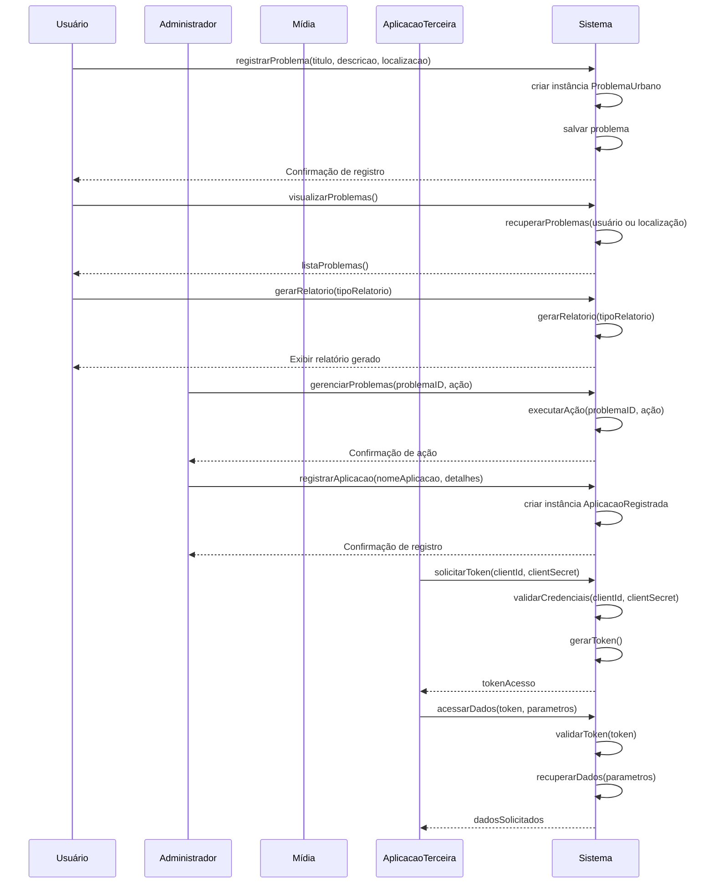

```mermaid
sequenceDiagram
    participant Usuário
    participant Administrador
    participant Mídia
    participant AplicacaoTerceira
    participant Sistema as Sistema
    %% Registrar Problema Urbano
    Usuário ->> Sistema: registrarProblema(titulo, descricao, localizacao)
    Sistema ->> Sistema: criar instância ProblemaUrbano
    Sistema ->> Sistema: salvar problema
    Sistema -->> Usuário: Confirmação de registro
    %% Visualizar Problemas
    Usuário ->> Sistema: visualizarProblemas()
    Sistema ->> Sistema: recuperarProblemas(usuário ou localização)
    Sistema -->> Usuário: listaProblemas()
    %% Gerar Relatórios
    Usuário ->> Sistema: gerarRelatorio(tipoRelatorio)
    Sistema ->> Sistema: gerarRelatorio(tipoRelatorio)
    Sistema -->> Usuário: Exibir relatório gerado
    %% Gerenciar Problemas
    Administrador ->> Sistema: gerenciarProblemas(problemaID, ação)
    Sistema ->> Sistema: executarAção(problemaID, ação)
    Sistema -->> Administrador: Confirmação de ação
    %% Registrar Aplicações Terceiras
    Administrador ->> Sistema: registrarAplicacao(nomeAplicacao, detalhes)
    Sistema ->> Sistema: criar instância AplicacaoRegistrada
    Sistema -->> Administrador: Confirmação de registro
    %% Gerar Tokens de Acesso
    AplicacaoTerceira ->> Sistema: solicitarToken(clientId, clientSecret)
    Sistema ->> Sistema: validarCredenciais(clientId, clientSecret)
    Sistema ->> Sistema: gerarToken()
    Sistema -->> AplicacaoTerceira: tokenAcesso
    %% Acessar Dados via API
    AplicacaoTerceira ->> Sistema: acessarDados(token, parametros)
    Sistema ->> Sistema: validarToken(token)
    Sistema ->> Sistema: recuperarDados(parametros)
    Sistema -->> AplicacaoTerceira: dadosSolicitados
```
